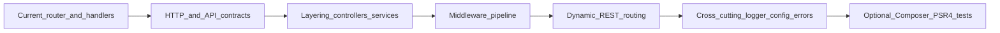

# Incremental path: vanilla simple-chat to “framework-shaped” backend

## Where you are now (honest estimate)

You are past “tutorial PHP” and into **early intermediate** backend work:

- **HTTP**: GET/POST, redirects vs JSON, status codes you’ve seen in practice (401/403/404).
- **Auth**: PHP sessions, cookie-backed login, server-side checks on APIs.
- **Data**: MySQL + schema thinking (users, messages, conversations, membership, FKs).
- **Structure**: Separated front-end, JSON APIs, and a **single entrypoint** (`[back-end/index.php](c:\xampp\htdocs\simple-chat\back-end\index.php)`) with **routing** via `require` (not redirects)—plus Apache rewrite (`[.htaccess](c:\xampp\htdocs\simple-chat\.htaccess)`) and **blocking direct handler URLs** (`[back-end/.htaccess](c:\xampp\htdocs\simple-chat\back-end\.htaccess)`).
- **Gaps typical at this stage**: formal layering (controllers/services/repos), middleware as a concept, consistent API contracts, automated tests, structured config/logging, dynamic REST routes as first-class design.

That is a solid base to refactor upward **without** abandoning vanilla.

---

## Principles (how we will learn)

- **One concept per refactor**, then **verify** (browser + Postman + DB inspection). No “big bang rewrite.”
- **You implement; I guide.** Explanations tie each change to HTTP lifecycle: request → routing → middleware → handler → response.
- **Vanilla first**: plain PHP files, `require`, arrays, simple classes later—**Composer/frameworks only when you ask for that phase.**
- **Frontend stays vanilla** until a late phase: deepen HTML/CSS/JS (modules, fetch patterns, small state discipline) before React.

---

## Phase map (high level)

---

## Phase 0 — Lock in mental models (1–2 weeks, light coding)

**Goal:** vocabulary matches reality (endpoint vs HTTP request vs entrypoint vs handler).

**Do on your project:**

- Draw (paper is fine) one flow: `POST /auth/login` → rewrite → `[index.php](c:\xampp\htdocs\simple-chat\back-end\index.php)` → `[login.php](c:\xampp\htdocs\simple-chat\back-end\login.php)` → redirect.
- Another: `GET /api/messages` → router → `[api_messages.php](c:\xampp\htdocs\simple-chat\back-end\api_messages.php)` → JSON.

**Exit criteria:** you can explain redirect vs `require` without mixing them.

---

## Phase 1 — REST API discipline (2–3 weeks)

**Goal:** your API behaves like a product API: predictable resources, methods, errors.

**Concepts:** resources (`/api/conversations`, `/api/messages`), query params, idempotency intuition, error body shape.

**Refactors (incremental):**

- Standardize JSON errors: always `{ "error": "..." }` + correct status (you already started this pattern).
- Add **versioning light** if needed: `/api/v1/...` (optional; only if you want the exercise).
- Document 5–10 endpoints in a simple `API.md` you maintain (learning artifact).

**Practice:** Postman collection folders: happy paths + negative tests (401/403/400).

**Exit criteria:** you can explain why `403` happened for a given request without guessing.

---

## Phase 2 — Introduce “controllers” without frameworks (2–4 weeks)

**Goal:** separate **routing** from **business logic** using plain PHP includes + small functions/classes.

**Concepts:** controller = “HTTP adapter,” service = “rules,” repository = “SQL.”

**Refactor shape (vanilla-friendly):**

- `back-end/http/Request.php` (thin wrapper: method, path, query, body)
- `back-end/http/Response.php` (json, redirect helpers)
- `back-end/controllers/AuthController.php`, `MessagesController.php` (plain classes or namespaced functions)
- Keep DB access out of controllers by moving SQL into `repositories/*.php` or `services/*.php`

**Educational rule:** move **one endpoint** end-to-end first (e.g. `GET /api/me`), prove it works, then migrate the next.

**Exit criteria:** `api_messages.php` becomes thin (or disappears) and the “what happens” logic is readable in one place.

---

## Phase 3 — Middleware pipeline (2–4 weeks)

**Goal:** cross-cutting concerns are not copy-pasted in every file.

**Concepts:** middleware = function `(Request $req, callable $next) => Response`.

**Apply to your app:**

- `AuthMiddleware`: session required for `/api/`*
- `JsonMiddleware`: sets JSON content-type defaults
- Optional: `CorsMiddleware` (only if you need cross-origin; understand security implications)

**Implementation style (vanilla):**

- Build a tiny `Pipeline` in plain PHP (array of callables), run in `[index.php](c:\xampp\htdocs\simple-chat\back-end\index.php)` before dispatching controller.

**Exit criteria:** no `isLoggedIn()` checks duplicated across every API file; unauthorized behavior is consistent.

---

## Phase 4 — Dynamic routing like `/posts/{id}` (2–4 weeks)

**Goal:** route patterns with parameters, still without a framework.

**Concepts:** route table + pattern matching + parameter extraction.

**Apply:**

- Add resources like `GET /api/conversations/{id}/messages` (or similar) using a matcher.
- Centralize route definitions in one array/map processed by the router.

**Exit criteria:** you can add a new parameterized route without editing five different `if/elseif` chains.

---

## Phase 5 — Logging, configuration, errors (2–3 weeks)

**Goal:** operability like production systems: traceability and safe config.

**Concepts:** structured logs, log levels, correlation id (lightweight), environment separation.

**Vanilla approach:**

- `Logger` writes to `storage/logs/app.log` (start with file; later rotate)
- Replace hardcoded DB creds in `[config.php](c:\xampp\htdocs\simple-chat\back-end\config.php)` with **local-only** env-style includes (still no Composer required—simple `putenv`/`getenv` or a tiny `env.php` you manage manually)

**Exit criteria:** when something breaks, you can find the request path + error in a log line.

---

## Phase 6 — Testing mindset (parallel or after Phase 5)

**Goal:** confidence that refactors don’t silently break auth and permissions.

**Concepts:** integration tests hit HTTP layer; minimal unit tests for pure functions.

**Vanilla-friendly options:**

- Start with a **Postman collection + automated tests** (you already use Postman).
- Later: PHPUnit **without** framework (optional Composer when you choose).

**Exit criteria:** a checklist you run before claiming “done” on a feature.

---

## Phase 7 — Frontend professionalism (vanilla) (ongoing, interleaved)

**Goal:** JS that doesn’t become spaghetti as features grow.

**Concepts:** modules (ES modules), small modules (`api.js`, `auth.js`, `ui.js`), fetch wrapper with consistent error handling, minimal state object.

**Apply to `[front-end/js/chat.js](c:\xampp\htdocs\simple-chat\front-end\js\chat.js)`:** split when it hurts, not before.

**Exit criteria:** adding a feature touches predictable files.

---

## Phase 8 — React (only when Phase 7 feels “boring”)

**Goal:** component model and ecosystem—**after** you’re solid in vanilla JS modules and API contracts.

**Bridge project:** rebuild one screen (login or chat list) in React consuming the same REST API.

---

## Phase 9 — Optional: Composer + PSR-4 + “real” packages (when you choose)

**Goal:** autoloading and dependency management—the concepts transfer across stacks.

**Not before:** you’re comfortable with classes, namespaces, and a clean folder layout.

---

## How we’ll work together in practice

Each step should follow:

1. **Goal + concept** (short)
2. **You implement a slice** in simple-chat
3. **We verify** (Postman + DB + logs)
4. **You write a 5-bullet “what I learned” note** (this prevents “generated but not learned”)

---

## Success definition (your stated end state)

You’ll have a codebase that demonstrates **framework-like architecture**—router, controllers, middleware, REST resources, logging—implemented in **plain PHP**, comparable in *concepts* to Laravel/Symfony routing pipelines, without needing to master those frameworks yet.